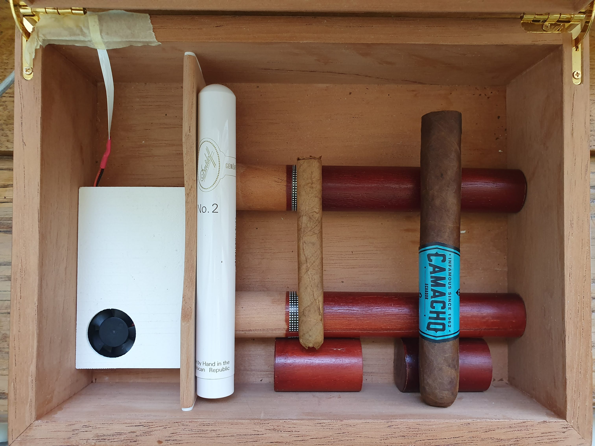
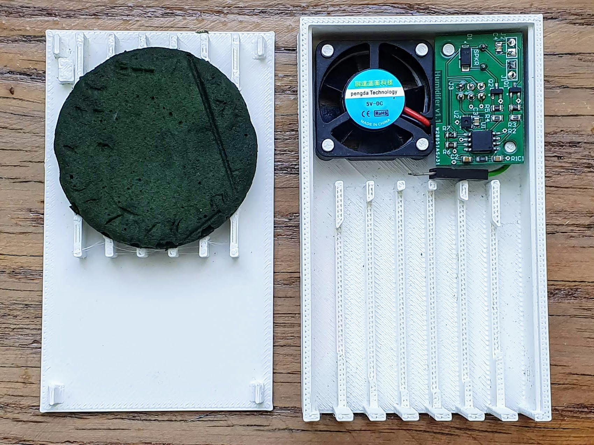
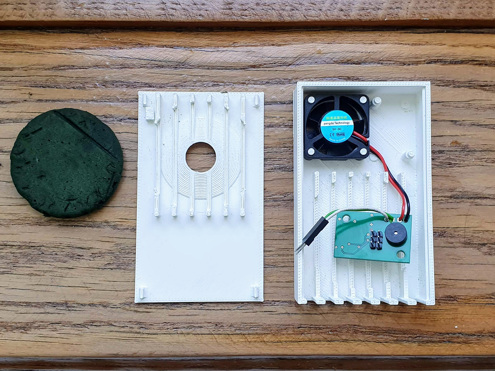
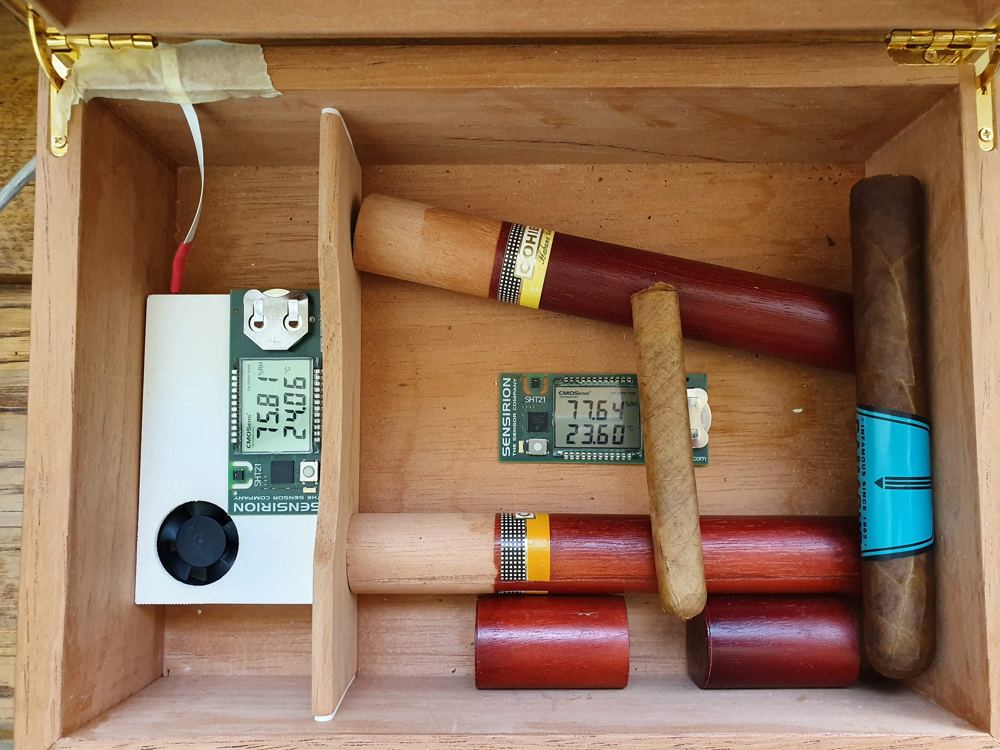

# Automatic cigar humidifier
This is a device to control the humidity in a humidor for storing cigars.

## The idea
I enjoy smoking a cigar from time to time. However, cigars need to be stored at a controlled humidity level until it is time to enjoy them. So, I bought a cheap humidor with a passive element in it for just that. A passive element works be releasing humidity until a certain relative humidity is reached but can also absorb excess humidity. In my case, this did not work properly: the foam would never reach the desired percentage of relative humidity. Thus, I set out to solve this issue.
## Defining requirements
I first defined some requirements before starting anything:
* The relative humidity should be actively controlled.
* The device should fit inside the humidor.
* If the humidity cannot be controlled for whatever reason, the user shall notice.
* No batteries to worry about.
## The solution
The device I built uses a humidity sensor (the SHT-31 by Sensirion), a fan and a piece of foam soaked in distilled water. If the sensor notices that the humidity drops below a certain threshold, the fan is switched on. It blows air over the wet foam, thus humidifying the air and raising the humidity inside the humidor. After the upper humidity threshold is reached, the fan is switched off. An integrated speaker alerts the user if the humidity cannot be raised after a certain time. The humidifier fits inside the humidor and is powered by a 5V USB charger, plugged into an outlet near the humidor.

## Testing
I have been using the humidifier in my humidor for about 6 months now with two Sensirion humidity and temperature measurements devices in the two compartments. The relative humidity setpoint is at 77%. As you can see below, this is kept quite closely.

## Improvements
I already noticed some possible improvements, but did not implement them as the humidifier works quite well:
1. The alarm is not often triggered, hence not that noticeable. However, triggering the alarm more often could be very annoying, as there is nothing in there preventing it from going off at 2 in the morning.
2. The fan control is only ON-OFF. A PWM control would help in making the device a bit quieter than it currently is. It is not loud, but noticeable in a quiet room.
3. The foam I used is not very absorbable. Thus, when filling the funnel in the back, the water runs over the foam and into the rest of the enclosure. A more absorbable foam should resolve that. Alternatively, extending the funnel into the foam would allow a more controlled water path.
## What is in the repository?
I documented my work here and I think it should be self-explanatory. Here is an overview:
### BOM
The bill of materials lists all the material used for building the humidifier. For the fan, just use any generic 30mm 5V fan. I got mine of AliExpress.
### Enclosure
The enclosure I designed holds the fan, PCB and the piece of 50mmx10mm foam I used to store the distilled water. It consists of the following parts:
* The cover clips into the enclosure and has a funnel to soak the foam without taking the cover off.
* The enclosure which has stubs to mount the fan, the PCB and the foam.
* Standoffs I needed to lift the PCB after I realised that it was sitting too low.

All are available as STLs, so you can directly 3D print them. I also included the Fusion 360 project as an F3Z file. I printed the parts on my Cetus 3D and they turned out great, with the clipping action holding up to several cycles so far.
### Images
Some images of the humidifier. They are also used in this readme.
### PCB
Contains the Gerber and NG Drill files you need if you want to build this humidifier.
### Schematics
The schematic is stored here. If you open it in Adobe Reader, you can even click the parts to reveal more information.
### Software
The Arduino software is stored here. You will need to load the Arduino bootloader onto the ATiny85 before using it. Check [SpenceKonde's ATTinyCore](https://github.com/SpenceKonde/ATTinyCore) on how to do this. 

